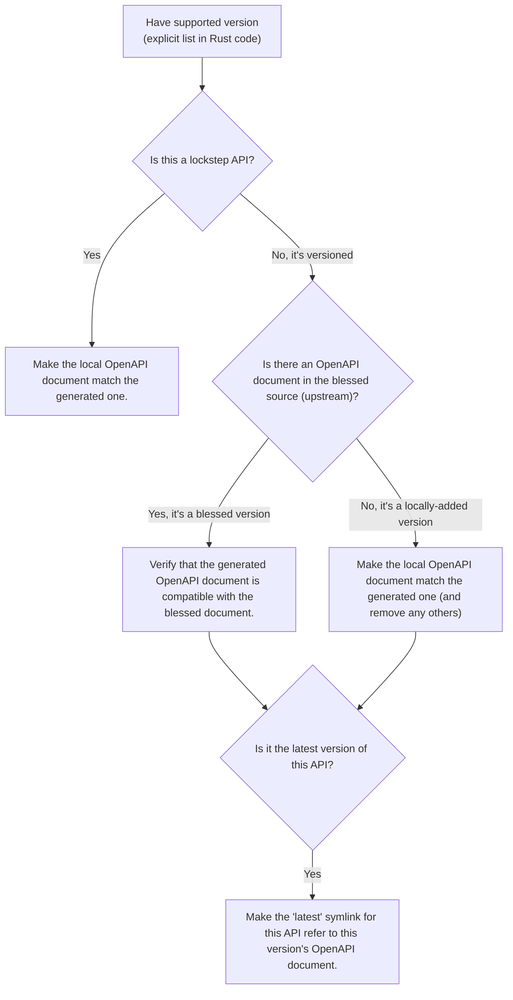

# OpenAPI manager

This crate provides most of the scaffolding to manage OpenAPI documents generated by Dropshot, using its support for **API traits**.

For more information about API traits, see [Oxide RFD 479](https://rfd.shared.oxide.computer/rfd/0479).

> [!NOTE]
> The OpenAPI manager relies on symbolic links for some of its functionality. If you're on Windows, you'll need to ensure that symlink support is enabled.
>
> * [Enable developer mode](https://learn.microsoft.com/en-us/windows/apps/get-started/enable-your-device-for-development#activate-developer-mode), which allows non-administrators to create symlinks.
> * Run `git config --global core.symlinks true`.

## Basic usage

TODO: Provide an example. Define "integration point", and refer to it as `cargo xtask openapi`.

### API crates

The OpenAPI manager requires as inputs a set of *API crates*. An API crate is a Rust library that consists of the API trait, and possibly supporting types. In general, each OpenAPI document should have a separate API crate, though it is acceptable to have multiple closely-related OpenAPI documents within the same crate.

In general, to keep compile times down, the API crate should have as few dependencies as possible. For an archetypal way to organize code, see the dependency graph in [RFD 479's _Choosing between functions and traits_](https://rfd.shared.oxide.computer/rfd/0479#functions_vs_traits).

## Managing OpenAPI documents

For OpenAPI documents to be managed by this tool, the corresponding interfaces must be defined via **API traits** rather than traditional Dropshot function-based servers.

### Adding new APIs

If you're defining a new service fronted by OpenAPI, first create an API crate (see <<api_crates>> above).

1. Add the API crate to the workspace's `Cargo.toml`.
2. Following the example in [RFD 479's _Trait definition_](https://rfd.shared.oxide.computer/rfd/0479#guide_trait_definition), define the API trait.

In the implementation crate:

1. Add a dependency on the API crate.
2. Following the example in [RFD 479's _API implementation_](https://rfd.shared.oxide.computer/rfd/0479#guide_api_implementation), provide an implementation of the trait.

Proceed to adding this API's OpenAPI document.

### Adding new OpenAPI documents

#### Deciding on a versioning strategy

When adding an API, you may need to decide on a versioning strategy for the document.

In simpler cases where clients are known to always match servers, the OpenAPI manager supports a **lockstep** versioning strategy. If you're unsure, start with a lockstep strategy.

For cases where clients and servers can potentially have be mismatched, such as when the server is updated to a new version but the client is not, Dropshot supports a more complex **versioned** strategy. See [RFD 532 ("Versioning for internal HTTP APIs")](https://rfd.shared.oxide.computer/rfd/0532) for a more complete discussion.

**For versioned APIs:** copy the following template into the **API crate** near the top, _above_ the `#[dropshot::api_description]`:

```rust
api_versions!([
    // WHEN CHANGING THE API (part 1 of 2):
    //
    // +- Pick a new semver and define it in the list below.  The list MUST
    // |  remain sorted, which generally means that your version should go at
    // |  the very top.
    // |
    // |  Duplicate this line, uncomment the *second* copy, update that copy for
    // |  your new API version, and leave the first copy commented out as an
    // |  example for the next person.
    // v
    // (next_int, IDENT),
    (1, INITIAL),
]);

// WHEN CHANGING THE API (part 2 of 2):
//
// The call to `api_versions!` above defines constants of type
// `semver::Version` that you can use in your Dropshot API definition to specify
// the version when a particular endpoint was added or removed.  For example, if
// you used:
//
//     (1, INITIAL)
//
// Then you could use `VERSION_INITIAL` as the version in which endpoints were
// added or removed.
```

**For both lockstep and versioned APIs:** once the API crate is defined, update the OpenAPI manager to manage the new OpenAPI document(s). Within this directory:

1. In your repository's integration point's `Cargo.toml`, add a dependency on the API crate.
2. Add the crate to the list of APIs managed by the OpenAPI manager. For versioned APIs, the `api_versions` macro defines a `supported_versions()` function, which you'll need to use

To ensure everything works well, run `cargo xtask openapi generate`. Your OpenAPI document should be generated on disk and listed in the output.

#### Performing extra validation [[extra_validation]]

By default, the OpenAPI manager does basic validation on the generated document. Some documents require extra validation steps.

It's best to put extra validation next to the trait, within the API crate.

1. In the API crate, add dependencies on `openapiv3` and `openapi-manager-types`.
2. Define a function with signature `fn validate_api(spec: &openapiv3::OpenAPI, mut cx: openapi_manager_types::ValidationContext<'_>) which performs the extra validation steps.
3. In the list of managed APIs, set the `extra_validation` field to this function.

Currently, the validator can do two things:

1. Via the `ValidationContext::report_error` function, report validation errors.
2. Via the `ValidationContext::record_file_contents` function, assert the contents of other generated files.

TODO: include example here.

### Iterating on lockstep APIs

Assuming you're starting from a fresh branch from `main`, the general workflow for making changes to a lockstep API looks like this:

1. Make whatever changes you want to the API crate (the trait definition)
2. In whichever order you want:
  * Update the server(s) (the trait impl).  You can immediately see what's needed with `cargo check`.
  * Update the client.  To do this, run `cargo xtask openapi generate` to regenerate the OpenAPI document.  Then `cargo check` will tell you how the client needs to be updated.
3. Repeat steps 1-2 as needed.

### Iterating on versioned APIs

This workflow is modeled after the lockstep one, but it's a little trickier because of the considerations around online update. **Check out the [Dropshot API Versioning](https://docs.rs/dropshot/latest/dropshot/index.html#api-versioning) docs for important background.**

Again, we assume you're starting from a fresh branch from "main".

1. Pull up the `api_versions!` call for your API, in the root of the API crate.

2. Follow the instructions there to pick a new version number (the next unused integer) and an identifier.  For this example, suppose you find:

    ```rust
    api_versions!([
      (1, INITIAL),
    ])
    ```

    You'll change this to:

    ```rust
    api_versions!([
        (2, MY_CHANGE),
        (1, INITIAL),
    ])
    ```

   Among other things, the `api_versions!` call turns these identifiers into named constants that you'll use in the next step.  For example, `(1, INITIAL)` defines a constant `VERSION_INITIAL` and `(2, MY_CHANGE)` defines the constant `VERSION_MY_CHANGE`.

3. Also in the API crate, make your API changes.  However, you have to preserve the behavior of previous versions of the API. For some examples, see [Dropshot's versioning example](https://github.com/oxidecomputer/dropshot/blob/main/dropshot/examples/versioning.rs).

    * If you're adding a new endpoint, then your new endpoint's `#[endpoint]` attribute should say `versions = VERSION_MY_CHANGE..` (meaning "introduced in version `VERSION_MY_CHANGE`").
    * If you're removing an endpoint, then you want to change the endpoint's `#[endpoint]` attribute to say `versions = ..VERSION_MY_CHANGE` (meaning "removed in version `VERSION_MY_CHANGE`).  (If the endpoint was previously introduced in some other version, then the new value might say `versions = VERSION_OTHER..VERSION_MY_CHANGE` instead of `versions = ..VERSION_MY_CHANGE`.)
    * If you're changing the arguments or return type of an endpoint, you'll need to treat this as a separate add/remove:

      * Do not change the existing endpoint's arguments or return type at all.
      * Mark the existing endpoint as removed in `VERSION_MY_CHANGE` as described above.
      * Define new Rust types for the new version's arguments or return type (whichever are changing).
      * Define a new endpoint using the new types and introduced in `VERSION_MY_CHANGE`, as described above.

4. As with lockstep crates, you can do either of these in whichever order you want:

    * Update the server(s) (the trait impl).  You can immediately see what's needed with `cargo check`.
    * Update the client.  To do this, run `cargo xtask openapi generate` to regenerate the OpenAPI document(s).  Then `cargo check` will tell you how the  client(s) need to be updated.

5. Repeat steps 3-4 as needed.  You should **not** repeat steps 1-2 as you iterate.

As of this writing, every API has exactly one Rust client package and it's always generated from the latest version of the API.  Per RFD 532, this is sufficient for APIs that are server-side-only versioned.  For APIs that will be client-side versioned, you may need to create additional Rust packages that use Progenitor to generate clients based on older OpenAPI documents.  This has not been done before but is believed to be straightforward.

## More about versioned APIs

The idea behind versioned APIs is:

* This is an API where the client and server can be mismatched at runtime when the system is upgraded.
* Thus: for the system to keep working across an upgrade, the server _must_ support both the old and the new versions.
* To ensure that the server supports older versions, we check those OpenAPI documents into source control and this tool verifies that the server remains compatible with these older versions.

For much more on this, see [RFD 532 "Versioning for internal HTTP APIs"](https://rfd.shared.oxide.computer/rfd/0532).

For a versioned API, the set of all supported versions is defined by the `api_versions!` macro in the API crate.  More precisely: in configuring the OpenAPI manager tool to know about a versioned API, you use the `supported_versions()` function defined by the macro.  **This is critical: the OpenAPI documents in the `openapi` directory are _not_ the source of truth about what versions are supported.  The Rust `api_versions!` call is.**

Each of these supported versions is either **blessed** (meaning it's been committed-to -- i.e., shipped, or potentially deployed on a system that we care about upgrading smoothly) or **locally-added**. Currently, blessed versions are not allowed to change _at all_. In the near future, we hope to relax this a bit so that they can be changed in ways that are provably compatible (e.g., doc changes).

When you run `cargo xtask openapi check` or `cargo xtask openapi generate`, the tool loads OpenAPI documents from three sources:

* **blessed** documents: these are generally the OpenAPI documents in "main" in the `openapi` directory.  (More precisely, by default, these are loaded from the merge-base between `HEAD` and `main`. You can override this.) By definition, these only contain blessed versions (since locally-added versions won't be present in "main").
* **local** documents: these are the OpenAPI documents in `openapi` in your working tree. These include both blessed versions and locally-added versions.
* **generated** documents: these are the OpenAPI documents generated by Dropshot from your API traits.

Putting all this together, the tool is pretty straightforward.  For each supported version of a versioned API:

* If there is a blessed file for that version, then the version is blessed.  The generated file must exactly match the blessed one. If not, the tool cannot fix this.  You have to undo whatever changes you made that affected the blessed version. (See above on how to make changes to the API trait without affecting older versions.)
* If there is no blessed file for that version, then the version is locally-added.  There should be exactly one local file for it and it should exactly match the generated file.  The tool can fix any problems here by removing all local files and generating a new one based on the generated one.
* The tool also ensures that a "latest" symlink exists and points to the highest-numbered OpenAPI document.



You generally don't need to think about any of this to use the tool.  Like with lockstep APIs, you just use `cargo xtask openapi generate` to update the local files. The only ways you're likely to run into trouble are:

1. You forgot to define a new version.  In this case, you'll get an error about having changed a blessed version.  To fix this, you'll need to follow the steps above to make changes that don't affect older versions.
2. You defined a new version, but forgot to annotate the API endpoints with what version they were added or removed in.  Again, you'll get an error about having changed a blessed version and you'll need to follow the steps above to fix it.
3. You merge with an upstream that adds new versions.

### Merging with upstream changes to versioned APIs

When you merge with commits that added one or more versions to the same API that you also changed locally:

* Git will report a merge conflict in the "latest" symlink.  Just remove the symlink altogether (with `rm`).  This will be regenerated correctly below.
* Git will report a merge conflict in the API crate in the `api_versions!` call.  You will need to resolve this by hand.  **This is the most important part to get right.**  Generally, this is easy: you'll take all the versions that are present upstream, choose a new number for your locally-added version, and make sure that your locally-added one remains the latest one (first in the list).
* Less commonly: you may have other merge conflicts in the API crate or the server implementation.  This would happen if specific endpoints were changed both upstream and locally.  The details here are situation-dependent.  You'll have to resolve these by hand.

  Aside from merge conflicts from specific endpoints that were changed both upstream and in your local version, you generally should _not_ need to change any of the API crate as part of the merge.  (This is why we use identifiers for the semvers that go in the `versions` argument -- so that the value can change after a merge without having to go update all the endpoints you changed.)
* When you've resolved all conflicts, run `cargo xtask openapi generate` to regenerate files for locally-added versions and clean up any stale files.

Most commonly, this boils down to:

* `rm` the "latest" symlink
* fix up the `api_versions!` call in the API crate
* run `cargo xtask openapi generate`

If you get any of this wrong, the tool should clearly report the problem.  For example, if you mis-order the versions in the list, you'll get an error about them not being sequential.  If you mismerge the API trait in such a way that changes a blessed version, as always, the tool will detect that and report it.

### Retiring old versions of versioned APIs

Of course, we don't need or want to support each version of an API forever.  RFD 532 proposes supporting the one shipped in the last release, plus all the intermediate ones shipped in the current release.  The specific policy doesn't really matter here.

To retire an old version:

1. Remove it from `api_versions!`.
2. Remove any references to its `VERSION_` identifier (these will show up as compile errors when you run `cargo xtask openapi generate`).
3. Run `cargo xtask openapi generate` to remove the old files.

### Converting lockstep APIs to be versioned

An existing lockstep API can be made versioned.  You would do this when transitioning an API to support online update.  We'll use a hypothetical example with a `dns-server` API defined in a `dns-server-api` crate:

1. Initially, its OpenAPI document is stored in `openapi/dns-server.json`.
2. Run `git rm -f openapi/dns-server.json`.
3. Run `mkdir openapi/dns-server`.
4. Update the API crate (`dns-server-api/src/lib.rs`) to use the new `api_versions!` macro.  See the instructions under <<_adding_new_openapi_documents>> above.
5. Within the integration point, update the OpenAPI manager configuration to specify that the API is now versioned.  You'll use the `supported_versions()` function defined by the `api_versions!` macro.
6. Run `cargo xtask openapi generate`.  This will generate a new file under `openapi/dns-server` for your initial server version, along with a "latest" symlink.

    You will probably see this warning:

    ```
    Loading blessed OpenAPI documents from git revision "main" path "openapi"
    Warning skipping file "dns-server.json": this API is not a lockstep API
    ```

    This is okay.  It's saying: this is a versioned API, but the file we found upstream (i.e., in "main") suggests it's lockstep.  That's expected when you're doing this conversion.
7. Update references to the OpenAPI document elsewhere in the repo. For example, if you have a [Progenitor](https://docs.rs/progenitor/latest/progenitor/)-generated client for the OpenAPI document, it was likely reading form `openapi/dns-server.json`. The client should be updated to now generate it from `openapi/dns-server/dns-server-latest.json`.

That should be it!  Now, when iterating on the API, you'll need to follow the procedure described above for versioned APIs (which is slightly more complicated than the one for lockstep APIs).

In principle, this process could be reversed to convert an API from versioned to lockstep, but this almost certainly has runtime implications that would need to be considered.
